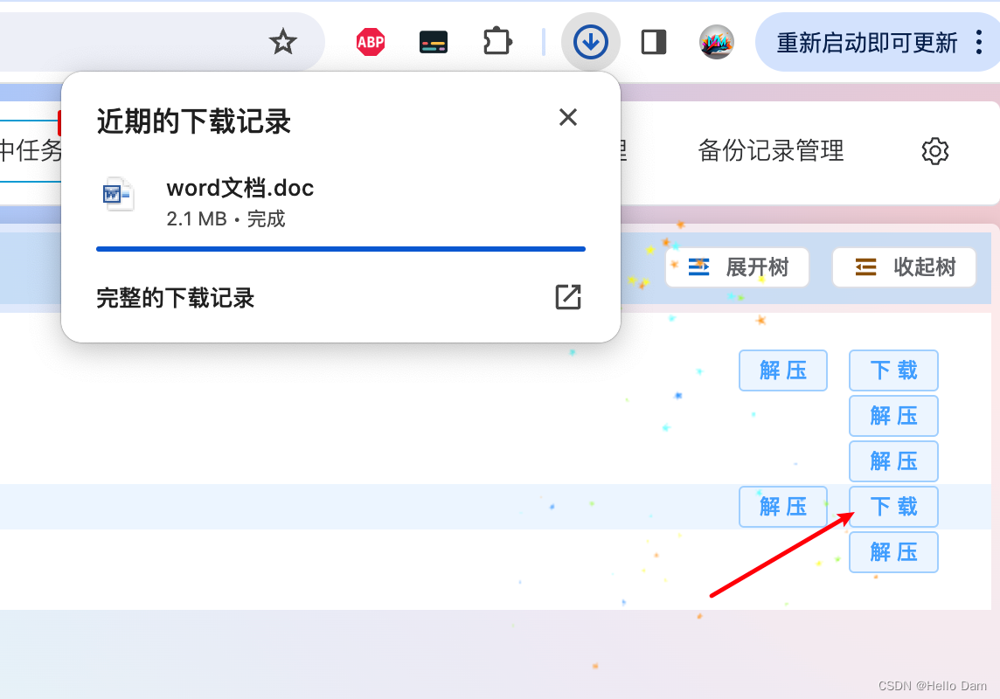
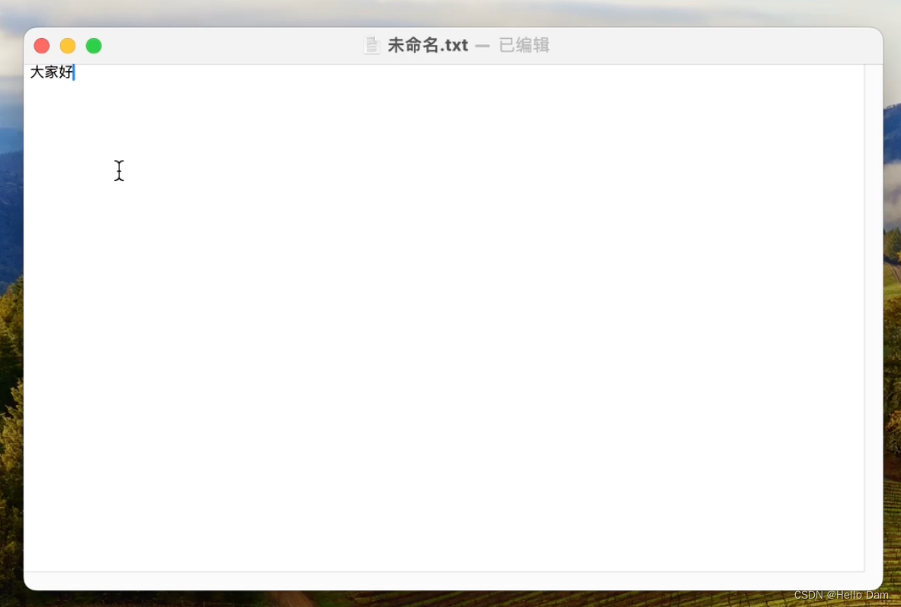
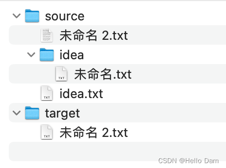
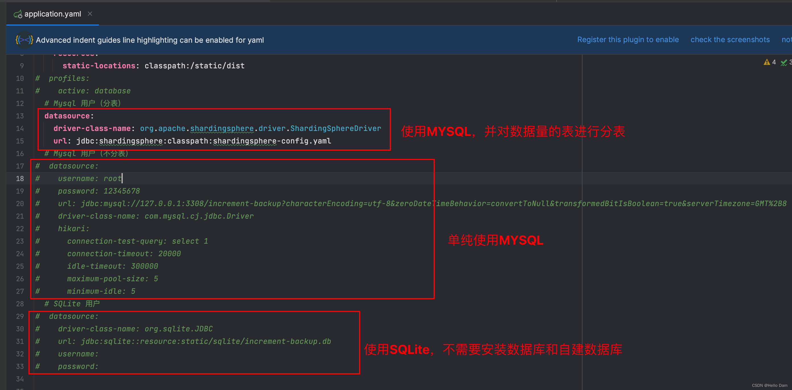

参考项目 https://github.com/epcdiy/timemachineplus 的备份实现思路，结合本人需求进行开发，如果大家觉得项目有用，希望可以点个`Star`呀

# 系统介绍
随着时代的发展，计算机相关技术日渐成熟，如今人们大部分数据存储在计算机中，许多数据非常珍贵，比如说学习编程的学生无法记住所有的技术如何使用，只能记得一个大概，因此大部分学生都会将自己学习的知识构建成一个知识网络存储在计算机中，倘若有一天电脑的固态坏了，里面的数据就很难再找回来，这样很多技术相当于白学。

为了避免这个悲剧的发生，我们需要经常对自己的重要数据进行备份。常见的备份方式是直接将计算机的数据备份到另一个固态硬盘中，因为两个固态硬盘同时损坏的概率是非常低的。但是如果直接将计算机的文件全部拷贝粘贴到硬盘中，这个效率会非常底下，因为很多文件距离上次备份可能是没有任何修改的，对这些没有修改过的文件进行备份，不止浪费时间，还会损伤硬盘的寿命。

为了解决这个问题，我开发了一个增量备份系统来辅助数据的备份，即将过往的备份信息存储到数据库中，在对文件执行备份之前，首先判断文件距上次备份是否有变动，如果有变动才进行备份，这样可以大大提高备份的效率。
# 功能说明
## 数据源增删改查

增加数据源时，有两种备份类型可以选择：一是将数据源中的数据全部备份到每个备份目标目录中（简称`全备份`）；二是将数据源中的数据分散备份到多个不同的备份目标目录中（简称`分散备份`）。此外，还可以选择是否对文件进行压缩，通过在备份时对文件进行压缩可以减少文件所占用的空间

## 数据备份目标目录增删改查
在增加备份目标目录之前，需要先勾选数据源，这样才可以建立两者的关联关系

## 备份
在勾选数据源之后，可以将数据源中的数据备份到备份目标目录中

## 查看任务的备份进度
为了方便用户查看任务的备份进度，系统开发了任务备份进度查看功能。如果备份类型为全备份，则数据源和每个备份目标目录形成一个备份任务，这些备份任务会异步多线程同时执行；如果备份类型为分散备份，则一个数据源只对应一个备份任务

同时任务备份结束之后，会给用户发送备份成功通知

## 备份任务管理
可以查看过往创建的备份任务的备份情况，如备份文件数量、备份文件大小、备份时间和备份状态

## 备份文件管理
存储备份文件的目的是为了让用户知道每个文件的源路径和目标路径，此外，还可以查看文件的备份次数、上次备份的时间

## 文件备份记录管理
记录文件每次备份的备份信息，如文件修改时间、文件备份时间，MD5码用来判断相同大小的文件内容距离上次备份时是否被修改，因为同样的输入，生成的MD5码是不变的，通过将文件输入流作为输入生成MD5码再和数据库中的MD5码进行比对，即可判断文件是否被修改

## 文件结构
因为有时候用户会选择分散备份，这样文件会被分散备份到多个备份目标目录中

为了让用户可以查看数据源原本的文件结构，系统会在备份的时候记录数据源的文件结构

通过复制文件的备份目标路径，即可快速找到文件被备份到何处

## 压缩
压缩后的文件后缀为`.easyBackupZip`

点击解压按钮，可以将压缩文件解压到压缩文件所在目录

除此之外，也可以将压缩文件下载为解压后的文件

## 清理
该功能是用来清理不必要的数据，例如本来数据源中有一个文件，这个文件被备份到目标目录中了，也在数据库中留下了备份的过程数据。但是后续从数据源中删除了该文件，认为该文件不再有用。使用清理功能可以从备份目标目录中将该文件删除，同时删除文件在数据库中留存的备份数据，减少数据库中的垃圾数据

## 忽略文件或目录
在备份时，可能有的文件并不需要进行备份，如Java项目的`.idea`，Vue项目的`node_modules`，通过设置忽略文件或目录，系统在备份的时候会跳过相应的文件或目录

# 测试
## 备份测试
### 备份
执行备份之后，备份目标目录的文件结构和数据源中的完全一致

### 创建新文件夹、新文件
在数据源中创建新的文件夹和文件，此时，数据源的文件结构和备份目标目录的文件结构不再一致

执行备份之后，备份目标目录的文件结构重新和数据源的一致

### 修改数据源中的数据
首先修改数据源中的文本数据

此时，备份目标目录中的文本数据如下

执行备份，备份目标目录中的文本数据被修改

## 文件结构同步测试
当前文件结构

从数据源中删除该文件

文件结构也同步更新

## 忽略文件或目录测试

通过设置忽略目录`idea`和文件`idea.txt`之后，再进行备份，得到的备份结果如下

# 系统技术栈
## 后端项目
- SpringBoot
- MybatisPlus
- SQLite、MySQL
- Java
- Websocket（用来实现备份进度显示）
- 压缩、解压工具
## 前端项目
- Vue
- Element Plus
- Axios
- Vite
- Websocket
# 启动方式
为了降低用户的使用门槛，系统数据库选用SQLite，因此用户无需安装并配置数据库。此外在将后端打成jar包之前，先整合了前端打包之后的文件，所以最终只需要启动jar包即可启动整个系统

系统启动成功之后，访问`localhost:8899`即可

## MYSQL方式启动
首先创建数据库，然后运行如下 sql 来创建数据库的表结构

项目目前有三种使用数据库的方式：
1. 使用SQLite（优点：使用便捷；缺点：性能较差，版本更新时，过往备份过程信息无法保留）
2. 单纯使用MYSQL数据库，不使用分表（优点：性能较好，版本更新时，过往备份过程信息不会丢失；缺点：需要用户按照MYSQL数据库并创建备份数据库和相应表结构）
3. 使用MYSQL数据库，并对数据量大的表进行分表（优点：将数据按照分片键分散到多个数据表中，可以提高单个数据源对应的查询效率）

说明：使用不同的数据库连接方式，只保留相应的数据库连接信息即可，其他连接方式的代码要注释掉。如果需要自定义成其他数据库，自己修改配置文件的数据库配置即可

如果使用分表的方式，记住还需要修改`shardingsphere-config.yaml`文件的数据库连接信息

# 系统现有不足
- 文件压缩使用现成工具类GZIP进行，压缩较大的文件会出现失败，因此本系统只对`10MB`（目前本人没有太多压缩需求，因此不对文件极限压缩大小进行压缩，大家有需求可以自由发挥）以下的文件进行压缩，这个参数可以在代码中进行修改
- SQLite数据库在编译项目或者打包项目的时候，数据库会清空，目前还没有找到合适的解决方案，如果小伙伴们有解决方法，希望可以不吝赐教（为了弥补该缺陷，大家可以将数据库替换为MySQL，或者其他数据库，这样性能更好、备份信息也不会丢失）
- 功能设计也可能有不合理的地方，或者有所欠缺，后续可能会根据大家的建议进行完善和补充
- 系统已经经过本人测试，对于本人的100多G目录，备份无问题，但不敢保证bug完全不出现，因为不同用户的文件不同，可能有本人没有考虑到的地方
# 页面优化
随着项目的更新，上述的功能说明页面并非最新页面，更新后的页面会在本节显示

因本人目前学业繁忙，部分功能现在还不够完善，项目后面会根据大家的需求和建议逐步完善
# 演示视频
[我开发了一个数据增量备份系统](https://www.bilibili.com/video/BV1sJ4m1b7Mu/)